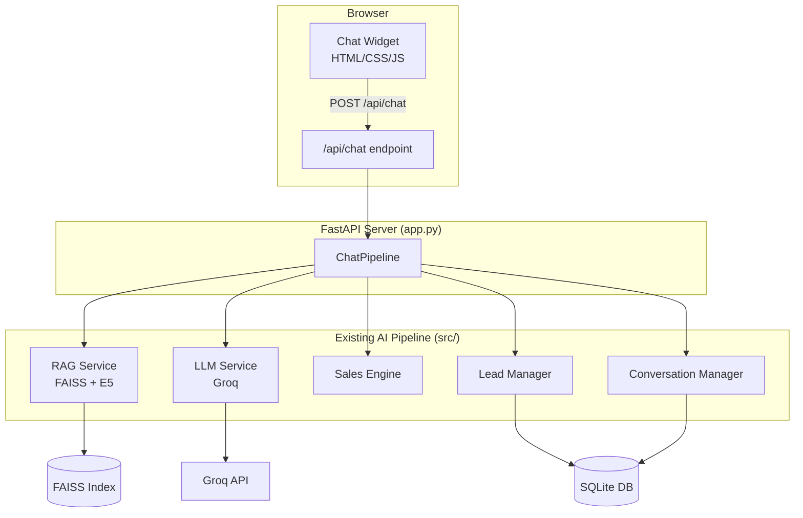

# Chatbot Web UI — Testing Interface untuk AI Sales Chatbot Nasi Kotak

## Background

Project ini sudah memiliki **AI pipeline lengkap** di `src/` (LLM + RAG + Sales Engine + Lead Manager), tetapi saat ini hanya bisa diuji via **Jupyter Notebook** atau **script Python**. Kita perlu membuat **web-based chatbot interface** agar bisa testing chatbot secara interaktif layaknya chatbot di website sebenarnya.

### Apa yang Sudah Ada

| Komponen | Status | File |
|---|---|---|
| LLM Service (Groq) | ✅ Selesai | [`llm_service.py`](file:///E:/KULIAH/Kerja/Chatbot-Nasikotak-AI-Engineer-/src/llm_service.py) |
| RAG Engine (FAISS + E5) | ✅ Selesai | [`rag_service.py`](file:///E:/KULIAH/Kerja/Chatbot-Nasikotak-AI-Engineer-/src/rag_service.py) |
| Sales Engine | ✅ Selesai | [`sales_engine.py`](file:///E:/KULIAH/Kerja/Chatbot-Nasikotak-AI-Engineer-/src/sales_engine.py) |
| Conversation Manager | ✅ Selesai | [`conversation_manager.py`](file:///E:/KULIAH/Kerja/Chatbot-Nasikotak-AI-Engineer-/src/conversation_manager.py) |
| Lead Manager | ✅ Selesai | [`lead_manager.py`](file:///E:/KULIAH/Kerja/Chatbot-Nasikotak-AI-Engineer-/src/lead_manager.py) |
| Full Pipeline (`ChatPipeline`) | ✅ Selesai | [`pipeline.py`](file:///E:/KULIAH/Kerja/Chatbot-Nasikotak-AI-Engineer-/src/pipeline.py) |
| Database (SQLite) | ✅ Selesai | [`database.py`](file:///E:/KULIAH/Kerja/Chatbot-Nasikotak-AI-Engineer-/src/database.py) |
| FAISS Index | ✅ Selesai | `faiss_index/` |
| **Backend API** | ❌ Belum ada | — |
| **Chat UI (Frontend)** | ❌ Belum ada | — |

### Apa yang Akan Dibuat

Membuat **FastAPI backend** + **HTML/CSS/JS chatbot widget** untuk testing chatbot secara interaktif di browser.

---

## User Review Required

> [!IMPORTANT]
> **Arsitektur: Monolith sederhana (FastAPI serve static files)**
> Karena tujuannya **testing/demo**, saya menggunakan pendekatan sederhana: FastAPI serve file HTML/CSS/JS secara langsung (tanpa React/build tools). Ini meminimalkan setup dan dependensi baru. Apakah ini OK, atau Anda lebih prefer React/Vite?

> [!IMPORTANT]
> **Dependensi baru: `fastapi` + `uvicorn`**
> Perlu ditambahkan ke `requirements.txt`. Ini sudah sesuai dengan arsitektur di PRD (Section 25: FastAPI API).

> [!WARNING]
> **Model LLM saat ini: `openai/gpt-oss-20b` via Groq**
> Di [`config.py`](file:///E:/KULIAH/Kerja/Chatbot-Nasikotak-AI-Engineer-/src/config.py) line 8, model yang dipakai adalah `openai/gpt-oss-20b`. Prompt Anda menyebut "Gemini 3.1 Pro" — apakah Anda ingin tetap menggunakan model Groq yang sudah ada, atau ingin migrasi ke Google Gemini 3.1 Pro? Migrasi ke Gemini memerlukan perubahan di `llm_service.py` dan `config.py`, serta mengganti SDK dari `groq` ke `google-genai`.

---

## Open Questions

> [!NOTE]
> 1. **Port server**: Default `8000`. Apakah ada preferensi port lain?
> 2. **CORS**: Karena ini testing local, CORS akan di-set allow all. OK?
> 3. **Persistensi DB**: Chat history akan disimpan ke SQLite seperti pipeline yang sudah ada. OK?

---

## Proposed Changes

### Component 1: Dependencies

#### [MODIFY] [`requirements.txt`](file:///E:/KULIAH/Kerja/Chatbot-Nasikotak-AI-Engineer-/requirements.txt)

Tambahkan dependensi FastAPI:
```diff
 # Core
 groq>=0.9
 sentence-transformers>=3.0
 faiss-cpu>=1.8
 sqlalchemy>=2.0
 
 # Utilities
 python-dotenv>=1.0
 pydantic>=2.0
 pyyaml>=6.0
 
+# Web Server
+fastapi>=0.110
+uvicorn[standard]>=0.30
+
 # Notebook
 jupyter
 ipywidgets
 
 # Testing
 pytest
```

---

### Component 2: FastAPI Backend

#### [NEW] [`app.py`](file:///E:/KULIAH/Kerja/Chatbot-Nasikotak-AI-Engineer-/app.py)

File utama FastAPI yang menghubungkan frontend dengan `ChatPipeline`:

```python
# Endpoints:
POST /api/chat          # Main chat endpoint
  Request:  { "session_id": "abc123", "message": "Saya butuh nasi kotak" }
  Response: { "reply": "...", "session_id": "...", "intent": "...", 
              "purchase_intent": "...", "actions": [...], 
              "needs_handover": bool, "whatsapp_link": "..." }

GET  /api/health        # Health check
POST /api/session/new   # Generate new session_id
GET  /                  # Serve frontend (index.html)
```

**Arsitektur internal:**
- Inisialisasi `ChatPipeline` saat startup (load FAISS index, model, dll.)
- Setiap request `/api/chat` memanggil `pipeline.chat()` langsung
- Session ID di-manage via frontend (UUID), dikirim via request body
- Error handling: Return friendly error message jika pipeline error
- CORS middleware (allow all untuk testing)
- Static files mount: `/static` → `static/`

---

### Component 3: Frontend — Chat Widget

#### [NEW] `static/` directory

```text
static/
├── index.html      # Main page + chat widget
├── style.css       # Chat widget styling
└── script.js       # Chat logic & API calls
```

#### [NEW] [`static/index.html`](file:///E:/KULIAH/Kerja/Chatbot-Nasikotak-AI-Engineer-/static/index.html)

Landing page sederhana yang menampilkan chat widget. Desain:
- **Header**: Logo + nama "Ayam Bakar Pak D — AI Sales Assistant"
- **Chat widget**: Floating bubble (kanan bawah), expandable
- **Chat area**: Bubble messages (user = kanan, bot = kiri)
- **Input area**: Text input + send button
- **Quick replies**: Tombol shortcut ("Lihat Menu", "Ada Promo?", "Mau Pesan")
- **Typing indicator**: Animasi "..." saat menunggu response
- **WhatsApp CTA**: Jika ada `whatsapp_link` di response, tampilkan sebagai clickable button

#### [NEW] [`static/style.css`](file:///E:/KULIAH/Kerja/Chatbot-Nasikotak-AI-Engineer-/static/style.css)

Styling modern untuk chat widget:
- **Color scheme**: Warm orange/amber (sesuai branding "Ayam Bakar")
- **Dark mode** compatible
- **Glassmorphism** pada chat container
- **Smooth animations**: Slide-in untuk bubble, fade untuk typing indicator
- **Responsive**: Mobile-friendly (full-screen chat pada layar kecil)
- **Typography**: Google Font (Inter/Outfit)
- **Chat bubbles**: Rounded, shadow, gradient accent
- **Scrollable**: Chat area auto-scroll ke bawah saat pesan baru

#### [NEW] [`static/script.js`](file:///E:/KULIAH/Kerja/Chatbot-Nasikotak-AI-Engineer-/static/script.js)

Client-side logic:
```javascript
// Core functionality:
1. Session management (UUID, localStorage)
2. Send message → POST /api/chat
3. Render bot reply (with markdown support)
4. Render WhatsApp CTA button jika ada
5. Quick reply buttons
6. Typing indicator
7. Auto-scroll
8. Enter key to send
9. Error handling (network error, timeout)
10. Render debug info (intent, purchase_intent) di bawah bubble (optional toggle)
```

---

## Proposed Architecture



---

## File Summary

| # | File | Aksi | Deskripsi |
|---|---|---|---|
| 1 | `requirements.txt` | MODIFY | Tambah `fastapi`, `uvicorn` |
| 2 | `app.py` | NEW | FastAPI server, endpoints, pipeline init |
| 3 | `static/index.html` | NEW | Chat widget HTML |
| 4 | `static/style.css` | NEW | Premium chat widget styling |
| 5 | `static/script.js` | NEW | Chat logic, API calls, UX |

**Total: 1 file dimodifikasi, 4 file baru**

---

## Verification Plan

### Automated Tests
```bash
conda activate nasikotak
# 1. Install dependencies
pip install fastapi uvicorn[standard]

# 2. Start server
python app.py
# Server akan berjalan di http://localhost:8000

# 3. Test API via curl
curl -X POST http://localhost:8000/api/chat -H "Content-Type: application/json" -d '{"message": "Ada paket apa?"}'
```

### Manual Verification
1. Buka `http://localhost:8000` di browser
2. Klik chat bubble → Chat widget terbuka
3. Ketik "Halo" → Bot merespons dengan greeting
4. Ketik "Ada paket nasi kotak apa?" → Bot merespons dengan info produk dari RAG
5. Ketik "Budget 25 ribu, 100 box buat meeting" → Bot merekomendasikan paket
6. Ketik "Saya mau pesan" → Bot mengarahkan ke web pemesanan
7. Cek typing indicator, auto-scroll, quick replies
8. Cek WhatsApp CTA button muncul saat purchase intent tinggi
9. Test responsive di mobile viewport

### Kriteria Sukses
- [x] Chat widget terbuka/tutup dengan smooth animation
- [x] Pesan terkirim dan bot merespons dalam < 10 detik
- [x] Chat history terjaga dalam satu session
- [x] Quick reply buttons berfungsi
- [x] WhatsApp CTA link muncul saat diperlukan
- [x] Debug panel menampilkan intent & purchase_intent
- [x] Tidak ada console error di browser
